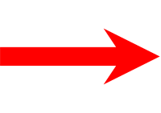
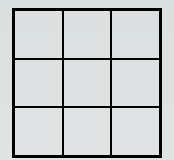

# Conway Game of Life Simulator

I created this simulator with React, using the [create-next-app](https://github.com/vercel/next.js/tree/canary/packages/create-next-app) template from [Next.js](https://nextjs.org/). This is an ongoing project that will have further updates.

## What is the Game of Life?
Existential answers aside, Conway's Game of Life is a model starting from an initial state on a two-dimensional grid, and then proceeds over an infinite number of "steps". Cells on the grid have two possible states: live or dead. 


Live cell displayed in blue

With each step in the model, cells interact with their eight adjacent cells (horizontal, vertical and diagonal). There are three conditions under which a cells state will change:

1. A live cell with fewer than two adjacent live cells dies;

  


2. A live cell with more than three adjacent live cells dies;

  

3. A dead cell with exactly three adjacent lives cells becomes live;

  

Note that any dead cells to which condition 3 does not apply, and any live cells with two or three live neighbours, do not change.

It should also be noted the simulator I've created is not yet perfect - at present, any cells at the edge of the finite grid displayed are assumed to have fewer than eight adjacent cells. The long-term plan is to change this to be more accurate, but for the moment stable configurations, oscillators and spaceships should work as expected (see below for more details on these).


## Getting Started

If running the code for the first time, ensure you have a recent version of npm, and then run:

```bash
npm install
```

Then to start the simulator, run the development server:

```bash
npm run dev
```

Then open [http://localhost:3000](http://localhost:3000) to view the simulator.

## How to play

1. Create your initial configuration by clicking cells to become live (shown in blue).
2. Press play.
3. Observe.


That's it! 

Of course, the Game of Life is interesting because some configurations are stable, or have a repeating behaviour.

There are three main patterns that arise:

- Still lifes - these are the stable states, which are either initially configured or are evolved into.

 A beehive.

- Oscillators - a pattern of re-ocurring states over finite periods of time.

 A blinker.
- Spaceships - these are patterns that translate themselves, or "fly" across the grid.

 A glider.

- There are also configurations that can create spaceships!

 The Gosper Glider Gun.

You can see a more extensive list of patterns [here](https://en.wikipedia.org/wiki/Conway%27s_Game_of_Life).

After trying a few known combinations of live cells, put in your own initial states and watch what happens - sometimes the configuration forms into still lifes or oscillators, and sometimes chaos unfolds!

## Learn More about Next.js

- [Next.js Documentation](https://nextjs.org/docs) - learn about Next.js features and API.
- [Learn Next.js](https://nextjs.org/learn) - an interactive Next.js tutorial.